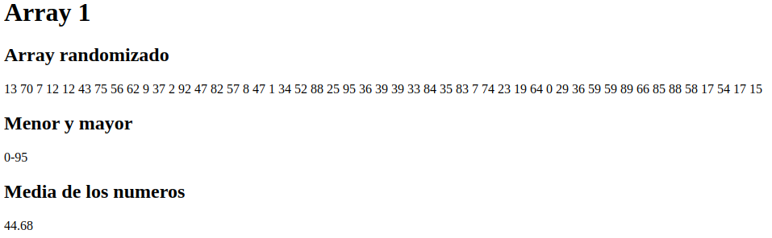

<h1>Ejercicios de arrays</h1>

<h2>Array1</h2>

Rellena un array con 50 números aleatorios comprendidos entre el 0 y el 99, y luego muéstralo en una
lista desordenada. Para crear un número aleatorio, utiliza la función rand(inicio, fin) => $num = rand
(0, 99)
• Como mejora comprobar que los números no existan.
• Ordenar la salida del vector.
• Calcula:
– El mayor
– El menor
– La media

